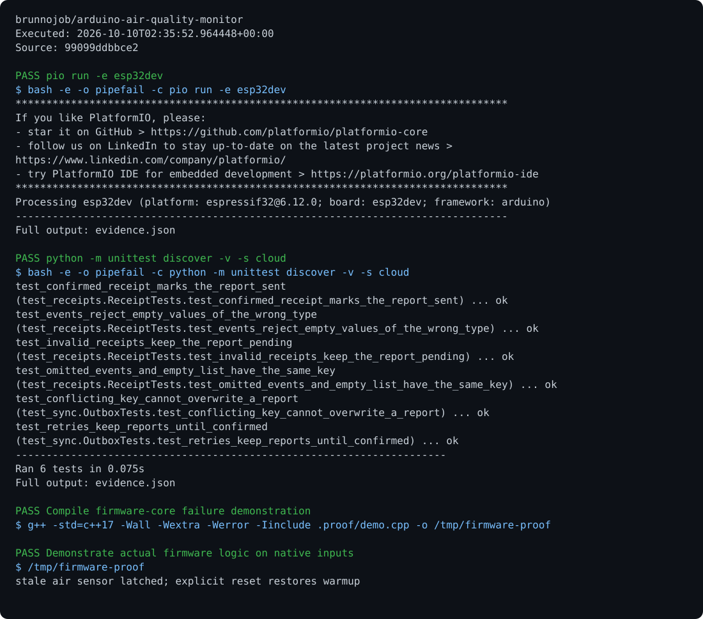

# Air Quality Monitor

An ADC monitor with a moving window, variance, warm-up, threshold confirmation, hysteresis, and sensor-failure detection.

## Run

Requirements: ESP32, C++17, and PlatformIO.

```sh
pio run -e esp32dev
pio run -e esp32dev -t upload
python -m pip install -r cloud/requirements.txt
python cloud/serial_bridge.py /dev/ttyUSB0
```

## Behavior

ADC: GPIO 35. Indicator: GPIO 2. Initial warm-up takes 60 seconds. Values are ADC readings, not certified gas concentrations. Pure logic is in `include/air_monitor.hpp`; calibration depends on the chosen sensor.

## Optional report archive

Export a JSON report from the command above, then run `python cloud/sync.py enqueue result.json --project arduino-air-quality-monitor` and `python cloud/sync.py sync`. Synchronization requires `BRUNNODEV_ACCESS_TOKEN` and the external operations API; the local outbox retains unacknowledged reports.

## License

Original source and documentation are MIT licensed; see [LICENSE](LICENSE). Third-party dependencies and media retain their respective terms. Maintained by [Brunno Dev](https://brunnodev.store).

## Implementation update

The sensor watchdog runs on every device loop, including loops without a fresh ADC sample. Stale input latches a fault; timing settings must stay within the wrap-safe clock range. Native regression checks are in `tests/runtime_regressions.cpp`.

Contribution trailer: `Co-authored-by: nyctophile <329826984+ineedfoundmyway@users.noreply.github.com>`.

## Execution proof

[](https://github.com/brunnojob/arduino-air-quality-monitor/actions/workflows/proof.yml)



[Verified run](https://github.com/brunnojob/arduino-air-quality-monitor/actions/runs/38018015778) · [Execution report](docs/proof/evidence.json)

Run `python .proof/record.py` after installing the prerequisites above. The scenarios execute repository code and verify exit codes and expected output. CI publishes `execution-proof` with the transcript, input fingerprints and source commit. The downloadable report identifies the exact tested version; the workflow badge tracks the latest run.
